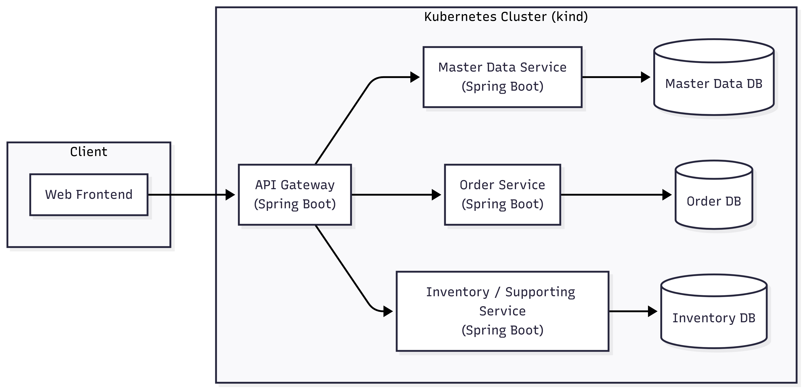

# Microservices Storage System Transformation

CLC 2025 Project

## Team Members

* Selina Adlberger
* Robin Berger
* Jonas Miesenböck

---

## Project Overview

This project focuses on designing and operating a cloud-native system on Kubernetes.

To provide a realistic foundation, we will implement a **minimal microservices-based storage and order management application**. This minimal application serves
only to demonstrate cloud-native infrastructure concepts, not as a feature-complete business system.

The core objective is to **design, deploy, and operate a cloud-native architecture** that demonstrates key principles such as:

* Containerized microservices on Kubernetes
* Autoscaling and resilience under load
* Observability and system transparency
* Self-healing behavior and fault tolerance
* Declarative and automated deployment practices

The system will be implemented in **Java with Spring Boot**, containerized using Docker, and orchestrated on **Kubernetes (kind)**.

---

## Background: Existing System

In a previous bachelor-level course, a storage and order management system was implemented in **C#**, focusing mainly on application logic and data persistence.

For this project:

* The existing implementation will not be reused
* Only the **domain idea** (storage, orders, inventory) will be carried over
* The system will be redesigned to fit the requirements of a cloud-native architecture

---

### Key Cloud-Native Concepts to Be Implemented

* **Autoscaling**
  * Horizontal Pod Autoscaler (HPA) to scale services under load
* **Self-Healing & Resilience**
  * Kubernetes-native self-healing (restarts, rescheduling)
  * Application-level resilience patterns (retries, timeouts, circuit breakers)
* **Observability**
  * Metrics collection with **Prometheus**
  * Visualization and dashboards using **Grafana**
* **Cloud-Native Deployment Practices**
  * Declarative Kubernetes manifests
  * Git-based configuration and reproducible deployments (GitOps-oriented workflow)
* **Fault and Stability Testing**
  * Controlled failure scenarios to demonstrate resilience and recovery behavior

---

## What We Will Develop

### Minimal Microservices Application

The system will consist of **approximately four lightweight microservices**, an API Gateway, and a simple frontend.

The services are intentionally small and simple, providing just enough functionality to:

* Generate load
* Exchange data between services
* Observe scaling, failures, and recovery behavior

#### Microservices

* **Master Data Service**  
  Manages basic reference data (e.g. products).

* **Order Service**  
  Provides simple order creation and querying to simulate workflows and load.

* **Inventory Service**  
  Manages basic stock levels and inventory changes.

* **API Gateway**  
  Serves as a single entry point for the frontend and routes requests to backend services.

No authentication or advanced business logic will be implemented, as these are not required for demonstrating cloud-native behavior.

---

### Frontend

A **minimal web frontend** will be provided to:

* Trigger requests
* Generate load
* Interact with the API Gateway

---

## Containerization and Kubernetes Platform

* Each service will be **containerized using Docker**
* The full system will run on **Kubernetes via kind**
* Kubernetes manifests will define:
  * Deployments
  * Services
  * Autoscaling rules
  * Health checks and resource limits

The platform setup is designed to **simulate real-world cloud-native deployments**, while remaining fully local and reproducible.

---

## Observability and Monitoring

To ensure traceability and transparency of system behavior:

* **Prometheus** will be used to collect metrics (CPU, memory, request rates, scaling events)
* **Grafana** will be used to visualize metrics and system behavior
* Metrics will be used to:
  * Demonstrate autoscaling under load
  * Observe recovery after failures
  * Analyze system stability

---

## CI/CD and Deployment Workflow

A GitHub Actions–based pipeline will be established to:

* Build and test services
* Build Docker images
* Validate Kubernetes manifests
* Support a **GitOps-style workflow**, where infrastructure changes are driven via version-controlled configuration

---

## Architecture Diagram

---

## Milestones

| Date           | Milestone                                              | Status     |
|----------------|--------------------------------------------------------|------------|
| **15.12.2025** | Proposal & Repository Setup                             | ✅ Done     |
| **20.12.2025** | Kubernetes Environment & Base Infrastructure Setup     | 📅 Planned |
| **04.01.2026** | Minimal Microservices Implementation                   | 📅 Planned |
| **08.01.2026** | API Gateway & Frontend Integration                     | 📅 Planned |
| **12.01.2026** | Dockerization & CI/CD Pipeline                          | 📅 Planned |
| **19.01.2026** | Autoscaling, Observability & Resilience Implementation | 📅 Planned |
| **26.01.2026** | Fault Scenarios, Testing & Documentation                | 📅 Planned |
| **02.02.2026** | Final Presentation & Demonstration                     | 📅 Planned |

---

## Distribution of Work and Responsibilities

*Disclaimer:* Architectural decisions, infrastructure design, and evaluations will be carried out collaboratively. The roles below define primary focus areas.

### 👤 Selina – Application & Gateway Focus

* Master Data Service implementation (minimal functionality)
* API Gateway configuration and request routing
* Frontend setup for triggering requests and load
* Support for observability integration at application level

### 👤 Robin – Kubernetes & Cloud Infrastructure Focus

* Inventory Service implementation (minimal functionality)
* Kubernetes manifests (Deployments, Services, HPA)
* Autoscaling configuration and load testing scenarios
* Local Kubernetes cluster operation using kind

### 👤 Jonas – DevOps, CI/CD & Observability Focus

* Order Service implementation (minimal functionality)
* GitHub Actions CI/CD pipeline
* Prometheus and Grafana setup
* Monitoring dashboards and metric validation

---

### 🤝 Shared Responsibilities

* Cloud-native architecture design
* Resilience and self-healing strategy
* Documentation
* Preparation of final demonstration and presentation