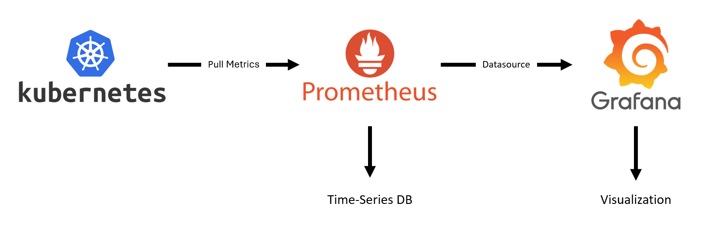
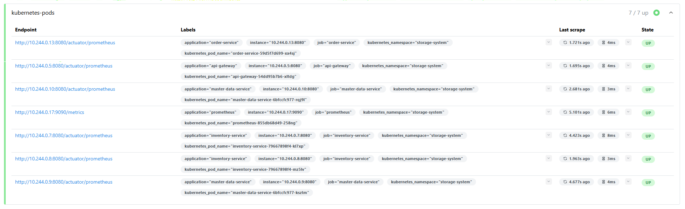
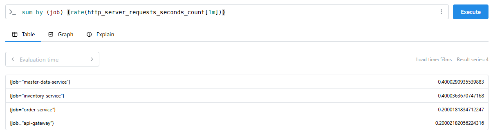
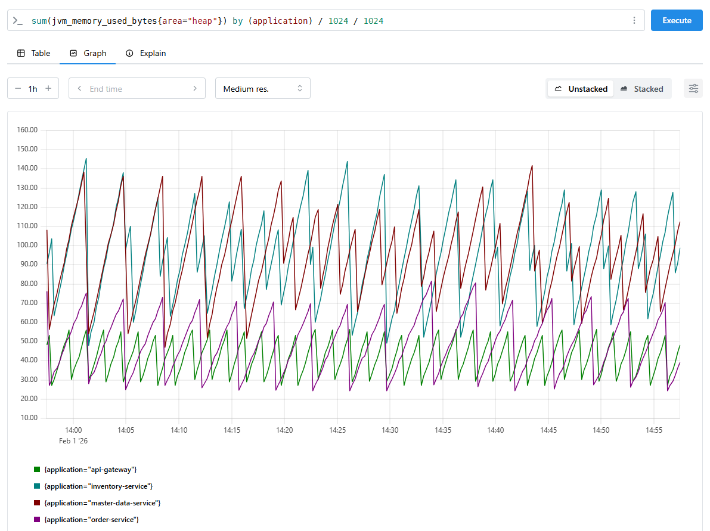
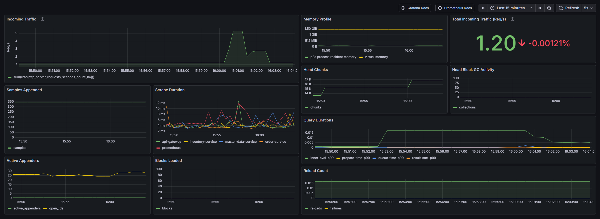
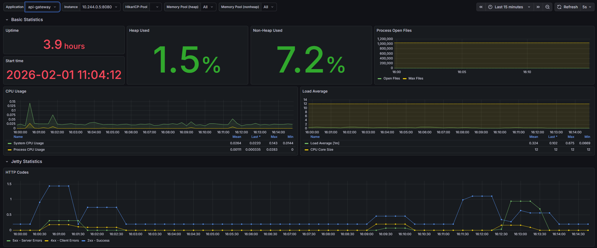
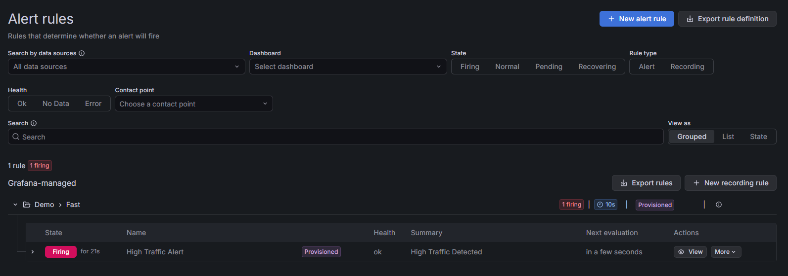

# Microservices Storage System Transformation

CLC 2025 – Cloud-Native Systems Project

This project demonstrates the design, deployment, and operation of a
cloud-native microservices system on Kubernetes.

Click [here](#tutorial) to get directly to the Tutorial.

## Team Members

* Selina Adlberger
* Robin Berger
* Jonas Miesenböck

---

##  Table of Contents
1. [Project Overview](#1-project-overview)
2. [Research & Architecture](#2-architecture--research)
3. [Tutorial: Getting Started](#3-tutorial-getting-started)
4. [Observability & Monitoring](#4-observability--monitoring)
5. [Lessons Learned](#5-lessons-learned)

---

## 1. Project Overview

This project focuses on designing and operating a cloud-native system on Kubernetes. To provide a realistic foundation, we deployed a minimal microservices-based storage and order management application.

This application serves to demonstrate cloud-native infrastructure concepts such as:
- Containerized microservices
- Automated deployments via Kustomize 
- Service Discovery & API Gateway patterns 
- Observability (Metrics & Monitoring)

The system is implemented in **Java with Spring Boot**, containerized using Docker, and orchestrated on **Kubernetes (kind)**.

### Project Structure

````yaml
clc-project/
├── .github/
│   └── workflows/
│       └── build-and-push.yaml      # Pipeline to build and push images to GH package registry
├── api-gateway                      # Spring Cloud Gateway (contains frontend)   
├── docs/                            # Documentation and diagrams
├── inventory-service                # Spring Boot microservice to store instances of products (counts)
├── k8s/                             # Kubernetes manifests (Kustomize)
│   ├── base/                        # Kubernetes manifests for microservices
│   │   ├── api-gateway/
│   │   ├── inventory-service/
│   │   ├── master-data-service/
│   │   ├── order-service/
│   │   └── kustomization.yaml
│   ├── overlays/                    # Additional manifests for deployment (prometheus, grafana)
│   │   └── dev/
│   │       ├── prometheus-grafana/
│   │       └── kustomization.yaml
│   └── namespace.yaml
├── master-data-service              # Spring Boot microservice to provide metadata about products
├── order-service                    # Spring Boot microservice to create orders
├── pom.xml
└── README.md
````

---

## 2. Architecture & Research

In this section, our research regarding the architectural style and the tooling required to implement a cloud-native system is summarized.

### 2.1. Architectural Decisions (Research)

This project aims to demonstrate a microservice-based system deployed on Kubernetes with basic observability.

1. **Local Kubernetes with kind**
- **Decision:** Run the cluster locally using kind.
- **Why:** Cloud credits expired, and a local cluster provides a simple, reproducible setup for showcasing Kubernetes manifests, service discovery, and monitoring.
- **Trade-offs:** Not production-like (no managed load balancer, limited persistence, and failure simulation).  
2. **API Gateway entry point**
- **Decision:** Expose a single gateway service and keep internal services cluster-private.
- **Why:** Centralizes routing and simplifies client access while keeping service-to-service communication internal.
- **Trade-offs:** Adds a hop and concentrates risk on the gateway.
3. **Database-per-service**
- **Decision:** Each microservice owns its own database.
- **Why:** Prevents shared-schema coupling and allows services to evolve independently.
- **Trade-offs:** Cross-service reporting and strong consistency are harder; integration patterns are required.
4. **Prometheus + Grafana for observability**
- **Decision:** Deploy Prometheus and Grafana in the dev overlay.
- **Why:** Enables service-level monitoring and dashboards without external tooling.
- **Trade-offs:** Metrics are covered first; centralized logs/tracing are not in scope yet.

### 2.2. High-Level Architecture

 

- **External Traffic:** All traffic enters the system via the API Gateway.
- **Internal Communication:** Services communicate synchronously using Kubernetes DNS Service Discovery.
- **Monitoring:** Prometheus and Grafana run alongside the application in the same cluster. 


### 2.3. Technology Stack & Tooling

#### Kubernetes (local cluster via kind)
We deploy the system to a local Kubernetes cluster using **kind** to keep the setup reproducible and independent of cloud credits.

Key Kubernetes resources used:
- **Namespace isolation:** all resources are deployed into a dedicated namespace.
- **Deployments:** each microservice is deployed as a `Deployment`.
    - Replicas: `inventory-service`, `master-data-service`, and `order-service` run with **3 replicas** to demonstrate horizontal scaling and rolling updates.
    - `api-gateway` runs as the single entry point and can be scaled independently.
- **Services (ClusterIP):** each microservice is exposed internally via a Kubernetes `Service` to enable stable DNS-based communication (`<service-name>:<port>`).
- **Database per service:** each microservice has its own database running inside the cluster, deployed as a separate component behind its own Service.
- **Persistent storage:** database data is persisted using **PersistentVolumeClaims (PVCs)** so that data survives pod restarts.
- **Environment configuration:** configuration (e.g., database connection parameters) is provided via Kubernetes environment variables and secrets (where applicable).
- **Configuration management:** manifests are organized using **Kustomize** (`k8s/base` + `k8s/overlays/dev`) to separate reusable base resources from dev-only additions (e.g., monitoring).

#### CI/CD (build & publish)
We use a lightweight CI pipeline to produce deployable container images:
- **Continuous Integration:** on commits to the main branch, the pipeline builds the service images.
- **Container registry:** images are pushed to a container registry to be pulled by the cluster.
- **Versioning:** images are tagged with the commit SHA to ensure deployments use immutable, traceable artifacts.


### 2.4. Implemented System

The system consists of four lightweight microservices, an API Gateway, and a minimal frontend.
The services are intentionally simple and serve primarily to demonstrate cloud-native behavior.

#### API Gateway & Frontend
- **Tech:** Spring Cloud Gateway, SPA (HTML/JS)
- **Role:** Single entry point, routes requests to backend services
- **Purpose:** Trigger requests and generate load

#### Master Data Service
- **Tech:** Java, Spring Boot
- **Role:** Provides static product data
- **Design:** Stateless microservice

#### Order Service
- **Tech:** Java, Spring Boot
- **Role:** Simulates order creation and inter-service communication

#### Inventory Service
- **Tech:** Java, Spring Boot
- **Role:** Manages stock levels based on orders

---

## 3. Tutorial: Getting Started <span id="tutorial"></span>

Follow the following steps to reproduce the environment locally.

### Prerequisites
* **Docker Desktop** (running)
* **Kind** (Kubernetes in Docker)
* **Kubectl**
* **Git**
* **GitHub Personal Access Token (PAT)** 

---

### Step 1: Initiating a new build (Optional)

If you want to build the code from source instead of pulling existing images:

```bash
# commit to the main branch, to trigger a new build
```

### Step 2: Kubernetes Cluster Setup & Deployment

```bash
# Create cluster
kind create cluster --name storage-system
# Change context
kubectl config use-context kind-storage-system
# Create namespace
kubectl apply -f k8s/namespace.yaml
```

### Step 3: Deployment

To pull images from the GitHub Container Registry (GHCR), we need to create a secret.

```bash
kubectl create secret docker-registry ghcr-credentials \
  --docker-server=ghcr.io \
  --docker-username=<GITHUB-USERNAME> \
  --docker-password=<PAT-TOKEN> \
  --docker-email=<EMAIL> \
  -n storage-system
``` 

Deploy the cluster using the following command:
```bash
kubectl apply -k k8s/overlays/dev
```


### Step 4: Verify Deployment

Check if all pods are running:

```bash
kubectl get pods -n storage-system
```

Once running, forward the API Gateway port to access the frontend:

```bash
kubectl port-forward svc/api-gateway 8080:8080 -n storage-system
```

**Open Application:** http://localhost:8080/index.html

---

## 4. Observability & Monitoring

### Technology Stack

This stack utilizes [**Prometheus**](https://prometheus.io) for metric collection, paired with [**Grafana**](https://grafana.com) for data visualization and alerting. This combination provides real-time insights into the cluster's performance and health.

* **Prometheus (Database Layer):** Prometheus acts as the storage system's time-series database. It actively scrapes metrics from applications at regular intervals.
* **Grafana (Visualization Layer):** While Prometheus is powerful, its native UI is designed for debugging rather than long-term monitoring. Grafana connects to Prometheus as a **Datasource**, querying the metrics and transforming them into easily customizable visualizations. 



### Configuring Slack Alerts (Optional)

To receive notifications in your Slack workspace, update the webhook configuration in the [grafana-alerting.yaml](k8s/overlays/dev/prometheus-grafana/grafana-alerting.yaml) file.

1. **Update the Webhook:** Replace the `SLACK_WEBHOOK_URL_PLACEHOLDER` in the [grafana-alerting.yaml](k8s/overlays/dev/prometheus-grafana/grafana-alerting.yaml) file with your desired Slack webhook URL.

    ```yaml
    # Snippet from grafana-alerting.yaml
    apiVersion: v1
    kind: ConfigMap
    metadata:
      name: grafana-alerting
      namespace: storage-system
    data:
      alerting.yaml: |
        apiVersion: 1

        contactPoints:
          - orgId: 1
            name: Slack-Channel
            receivers:
              - uid: slack-notifier
                type: slack
                settings:
                  icon_emoji: ':rotating_light:'
                  url: SLACK_WEBHOOK_URL_PLACEHOLDER
                  username: Grafana Bot
                disableResolveMessage: false
    ```
2. **Apply and Refresh:** If the cluster is already running, run the following commands to apply the new ConfigMap and restart the Grafana pod to pick up the changes
    ```bash
    # Apply cluster configurations
    kubectl apply -k k8s/overlays/dev

    # Restart Grafana by deleting the existing pod
    kubectl delete pod -l app=grafana -n storage-system
    ```

### Accessing the Web Interfaces
To access the dashboards locally, you must forward the service ports:

```bash
# Forward Prometheus to localhost:9090
kubectl port-forward svc/prometheus -n storage-system 9090:9090

# Forward Grafana to localhost:3000
kubectl port-forward svc/grafana -n storage-system 3000:3000
```

If the port forwarding is set up correctly, you can access the web interfaces via the URLs below.

**Prometheus URL**: http://localhost:9000

**Grafana URL**: http://localhost:3000

### Prometheus Web Interface

The Prometheus UI is a tool for ad-hoc queries and verifying that metrics are being collected correctly.

If you go to `Status > Target health`, you can see every endpoint that Prometheus is trying to scrape and the connection status.



After you made sure that every application shows up there, you can go to the `Query` tab, where you can write PromQL (Prometheus Query Language) queries and display the results either in table or graph view.

#### Example PromQL Queries

1. Health Check
   
    ```
    up
    ```
    

2. Requests per second averaged over the last minute

    ```
    sum by (job) (rate(http_server_requests_seconds_count[1m]))
    ```
    

3. Total amount of Heap Memory used by each application in Megabytes
    
    ```
    sum(jvm_memory_used_bytes{area="heap"}) by (application) / 1024 / 1024
    ```
    


### Grafana Web Interface


Grafana is where the health of the storage system can be observed through visual dashboards.

The first time you open the Grafana web interface, it will prompt you to sign in. You can find the credentials in the [grafana-deployment.yaml](k8s/overlays/dev/prometheus-grafana/grafana-deployment.yaml) file.


**Dashboards**: Navigate to the "Dashboards" section to view pre-configured visualizations. These dashboards pull data from Prometheus and display it in real-time.

#### **Prometheus Dashboard**

This dashboard is based on the [Prometheus 2.0 Stats Dashboard](https://grafana.com/grafana/dashboards/15489-prometheus-2-0-stats/). It provides monitoring for Prometheus itself, allowing tracking of the total incoming traffic, storage resource usage, and the duration of scrape loops.



#### **Spring Boot Monitoring Dashboard**

This dashboard is based on the [Spring Boot 2.1 System Monitor](https://grafana.com/grafana/dashboards/11378-justai-system-monitor/). It provides a comprehensive view of the internal health of the Java applications. You can switch between the different applications and their instances at the top left of the dashboard. Visualizations include HTTP Codes frequency, request frequency and latency, heap memory usage, garbage collection patterns, and active thread counts.



#### **Alerting**

A predefined alert rule (High Traffic Alert) can be seen under `Alerting > Alert rules`. The rule is triggered if more than `10` requests per second averaged over the last minute of total incoming traffic are registered. If the rule is triggered, it will display an alert in the Grafana web interface and also send a notification to Slack if the webhook URL is set up.



### Simulating Traffic (Optional)
 
To verify that Prometheus is actively scraping metrics and that your dashboards are updating, you can simulate traffic to the application. 

Run the following command in a PowerShell terminal to send continuous requests to the application's actuator endpoint, thereby simulating read activity:

```powershell
while ($true) { curl.exe -s -o NUL http://localhost:8080/actuator/health }
```

This command sends requests in an infinite loop as fast as your machine can process them to the `/actuator/health` endpoint and should also trigger the alert rule, which will then send a Slack notification if you chose to set up the webhook.

## 5. Lessons Learned

### Kubernetes & Deployments
- **CrashLoopBackOff debugging is mostly about logs and events, not guesswork.**  
  We learned to start with `kubectl describe pod` (events/probes) and `kubectl logs --previous` (last crash output). This saved time compared to repeatedly redeploying.

- **Readiness/Liveness probes and init containers strongly influence stability.**  
  A service can be “correct” but still restart if probes are too strict or if dependencies aren’t ready. Adding a “wait-for-db” mechanism and tuning probes made startup much more reliable.

- **Scaling stateless services is easy; stateful components need more care.**  
  Replicas for services were straightforward, but databases required persistence, stable configuration, and careful initialization to avoid data loss and inconsistent state.

### Data & Persistence
- **“Database per service” reduces coupling but increases operational overhead.**  
  Separate databases simplified service boundaries but required consistent secret/config management and more Kubernetes resources to maintain.

- **PersistentVolumeClaims are necessary even in local clusters but still behave differently than cloud storage.**  
  PVCs protected data across restarts, but local storage in kind has limitations compared to managed storage classes and real-world failure scenarios.

### CI/CD & Release Process
- **Immutable image tags (commit SHA) greatly improve traceability and debugging.**  
  When something broke, we could identify exactly which build was running and roll back to a known working version.

- **Automation is only useful when it’s reproducible locally.**  
  Ensuring the same Docker build works locally and in CI prevented “works on my machine” situations and reduced deployment surprises.